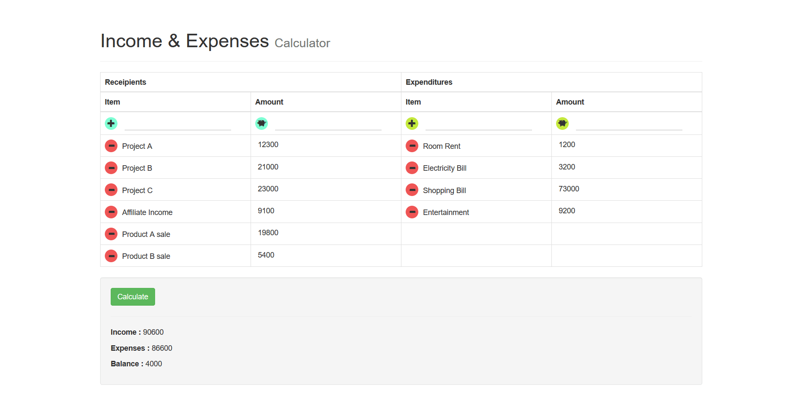

# Mini income expense calculator php without use of database
This is mini php project for beginners. Mini income and expense calculator with php.

This is just a real time fun project so no need to use database. But to extend it's feature we can connect it with database.

## Final output will be

